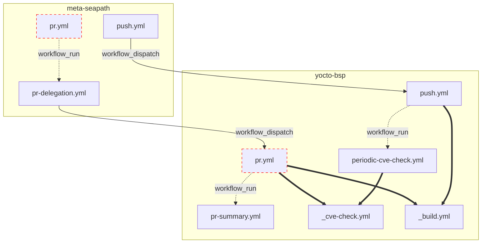

# CI/CD documentation

The red stroked boxes are the workflows that can potentially run in the context of an external contributor's PR. Those workflows are ran unprivileged: no secrets, read-only token (see https://docs.github.com/en/actions/reference/workflows-and-actions/events-that-trigger-workflows#workflows-in-forked-repositories).

