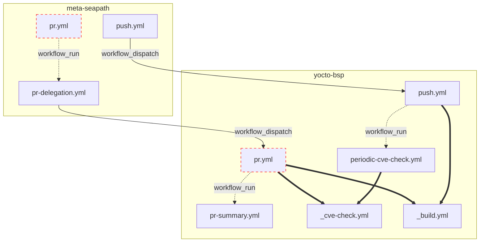

<!-- DON'T move this file up in .github otherwise it will be shown in the repository front page. -->

# CI/CD documentation

In order to centralize the CI on this repository, the CI on meta-seapath is redirected here via `workflow_dispatch` actions.

## Diagram

The red stroked boxes are the workflows that can potentially run in the context of an external contributor's PR. Those workflows are ran unprivileged: no secrets, read-only token (see https://docs.github.com/en/actions/reference/workflows-and-actions/events-that-trigger-workflows#workflows-in-forked-repositories).

Since we sometimes need secrets (e.g. to dispatch workflows) we circumvent this issue by chaining them to privileged workflows using `workflow_run` trigger. We need to be extra careful not to leak secrets in workflows that execute potential unsafe user code, thus **only the specific permissions should explicitely be set**.

